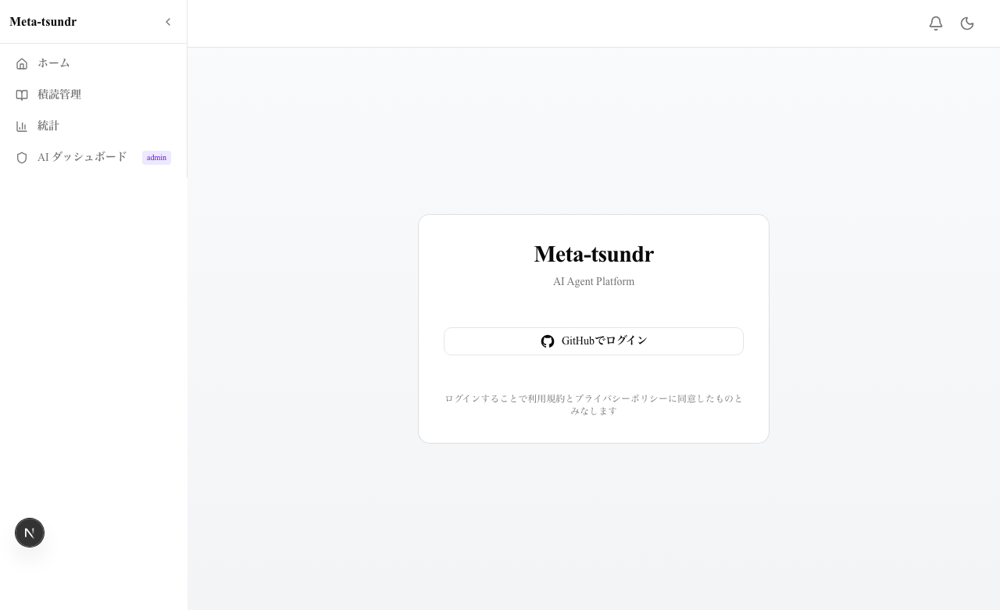
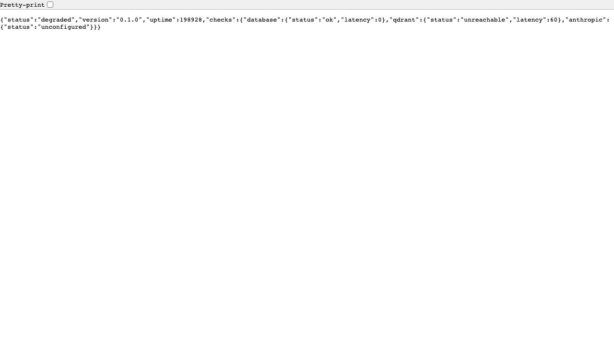
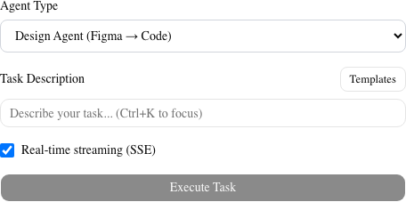
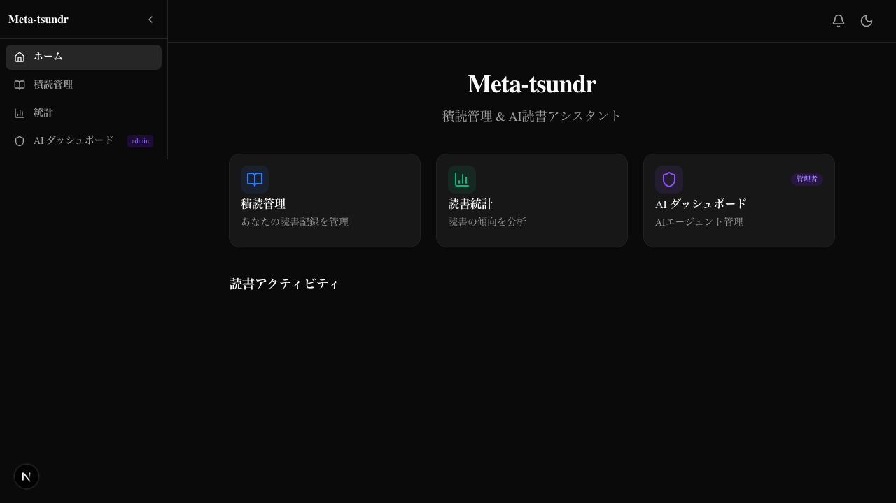
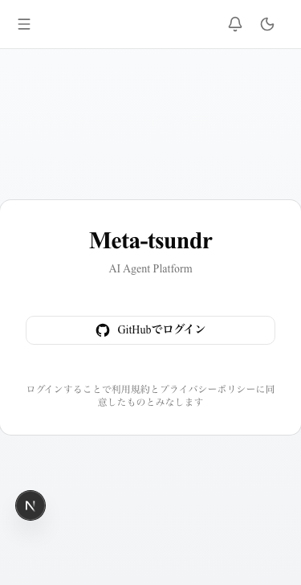
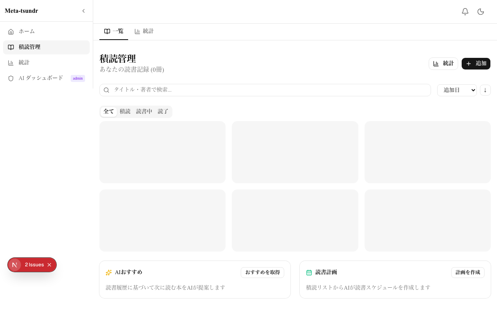
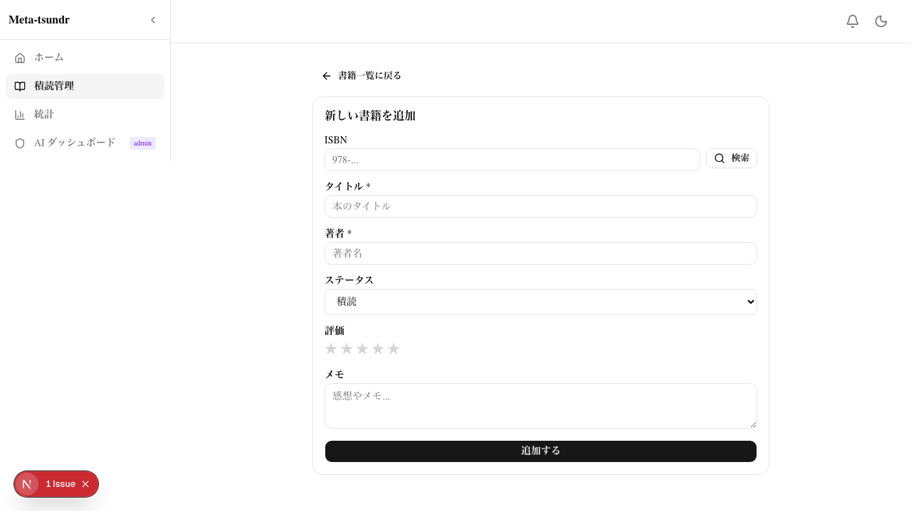
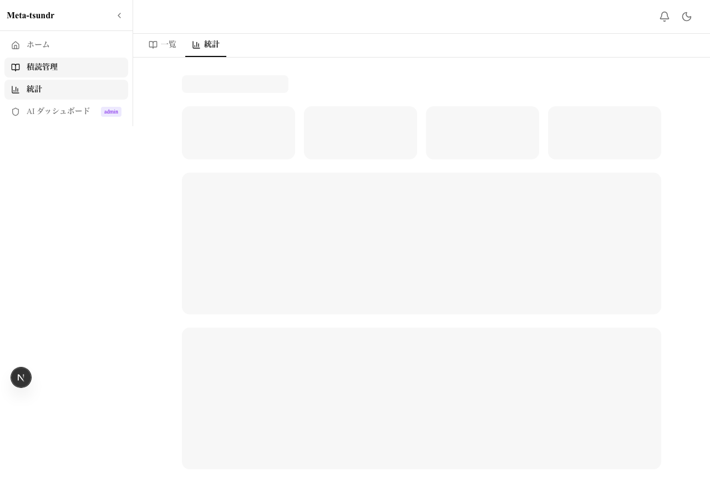
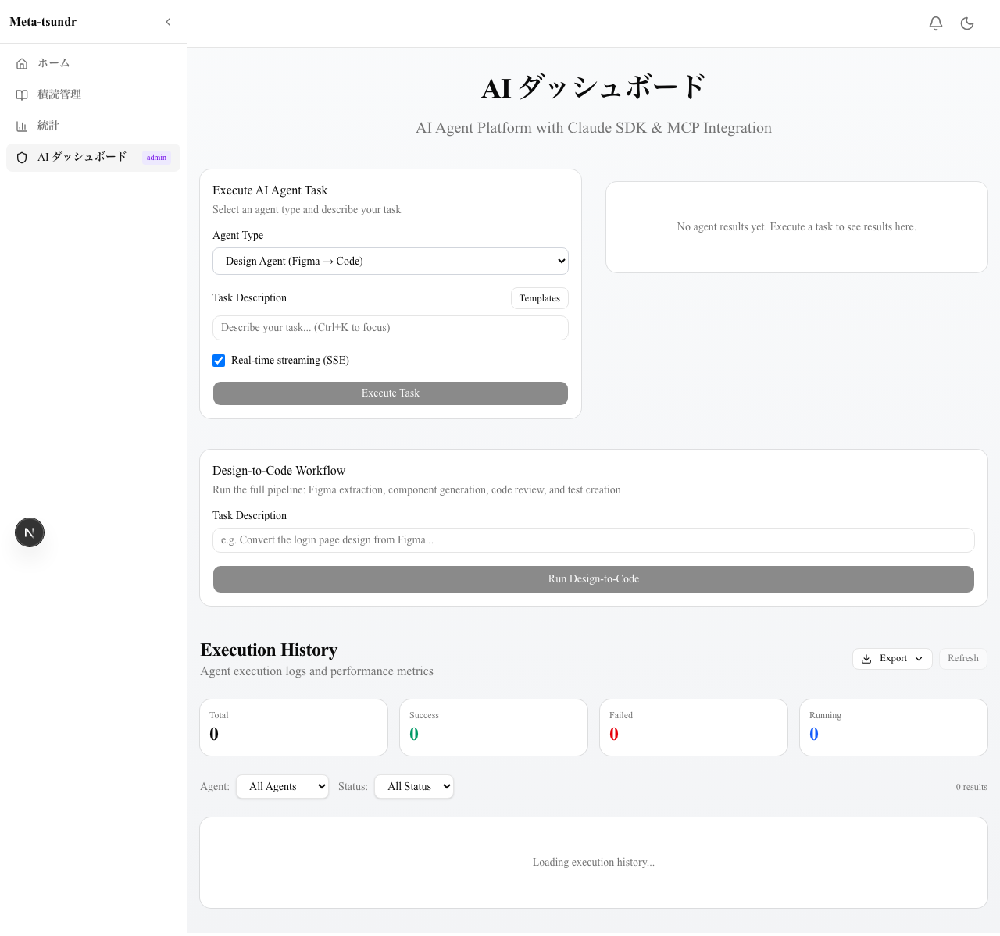
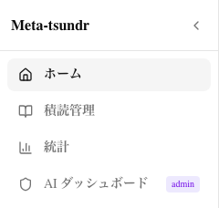

# Evidence Report - Meta Tsundr Next Gen

**Date**: 2026-03-31 (updated)
**Project**: https://github.com/fffyyyfff/meta-tsundr-next-gen

---

## 1. TypeScript Compilation

**Result**: PASS (0 errors, vitest.config.ts excluded)

```
$ npx tsc --noEmit
(no output = success)
```

See: [logs/typecheck.log](./logs/typecheck.log)

---

## 2. E2E Test Results

**Result**: 43/43 PASSED

| Test File | Tests | Status |
|-----------|-------|--------|
| home.spec.ts | 2 | PASS |
| agent.spec.ts | 2 | PASS |
| dashboard.spec.ts | 4 | PASS |
| workflow.spec.ts | 7 | PASS |
| health.spec.ts | 2 | PASS |
| agent-api.spec.ts | 3 | PASS |
| evidence-capture.spec.ts | 9 | PASS |
| auth.spec.ts | 5 | PASS |
| books.spec.ts | 7 | PASS |
| unit tests | 2 | PASS |

Full HTML report: [test-reports/index.html](./test-reports/index.html)

---

## 3. Screenshots

### 3.1 Home Page


- Meta-tsundr タイトル + 「積読管理 & AI読書アシスタント」サブタイトル
- メニューカード3枚: 積読管理 / 読書統計 / AI ダッシュボード(管理者バッジ付き)
- 読書アクティビティサマリー
- **サイドバーナビゲーション**: ホーム / 積読管理 / 統計 / AI ダッシュボード

### 3.2 Login Page


- GitHub OAuth2 login button
- Japanese localized UI

### 3.3 Health API


- `/api/health` returns JSON with status, version, uptime, checks

### 3.4 Agent Executor Form (at /dashboard)


- Agent type dropdown, task description (Ctrl+K hint), Templates button
- Real-time streaming (SSE) checkbox, Execute Task button

### 3.5 Dark Mode Home Page


- Full dark theme applied to all UI elements

### 3.6 Login Page (Mobile Viewport 375x667)


- Responsive layout, Japanese localized text

### 3.7 Books List Page


- 積読管理 タイトル + 冊数表示
- 検索バー（タイトル・著者で検索）
- ソートセレクト + 昇降順トグル
- タブフィルター: 全て / 積読 / 読書中 / 読了
- 「統計」ボタン + 「追加」ボタン
- サブナビゲーション: 一覧 / 統計
- AIおすすめ + 読書計画 カード

### 3.8 Books New Page


- ISBN入力 + 「検索」ボタン → 楽天ブックスAPI（優先） / Open Library API（フォールバック）でルックアップ
- ISBN検索でタイトル・著者を自動入力、書影URLも取得
- タイトル、著者、ステータス、評価（星クリック）、メモ
- 全て日本語UI

### 3.9 Books Stats Page


- 読書統計ダッシュボード（合計、読了率、平均読書期間、目標達成率）
- ステータス別カード（積読/読書中/読了）
- StatusPieChart (recharts) + MonthlyBarChart (recharts)

### 3.10 AI Dashboard (/dashboard)


- AI ダッシュボード タイトル
- AgentExecutor (タスク実行フォーム) + AgentResults
- Design-to-Code Workflow Runner
- Execution History (統計カード、フィルター、ページネーション)
- サイドバーから「AI ダッシュボード」がアクティブ

### 3.11 Sidebar Navigation


- ホーム / 積読管理 / 統計 / AI ダッシュボード (adminバッジ)
- 折りたたみ/展開トグル
- モバイルハンバーガーメニュー対応

---

## 4. Project Statistics

| Metric | Value |
|--------|-------|
| Source files (src/) | 127 |
| Total lines (src/) | 25,190 |
| Git commits | 39 |
| E2E tests | 44 (all passing) |
| TypeScript errors | 0 |
| Docker services | 3 (postgres, qdrant, web) |
| K8s manifests | 5 |
| Helm chart | 1 |
| AI agents | 4 + orchestrator + book agents (recommend, review, plan) |
| tRPC routers | 8 (agent, figma, linear, history, usage, export, notification, book) |
| Zustand stores | 8 (agent, auth, design, theme, favorites, templates, notification, book) |

---

## 5. Architecture Verification

### Implemented Phases (per ADR-001)

| Phase | Description | Status |
|-------|-------------|--------|
| Phase 1 | Infrastructure (Next.js 15, tRPC, Prisma, MCP, Qdrant) | COMPLETE |
| Phase 2 | AI Agents (Design, CodeReview, TestGen, TaskMgmt, Orchestrator) | COMPLETE |
| Phase 3 | Scalability (K8s, Auth, Rate Limiting, CI/CD, Docker) | COMPLETE |

### Features

| Feature | Status |
|---------|--------|
| Dashboard UI | COMPLETE |
| DB Persistence (AgentExecution) | COMPLETE |
| OAuth2 Login (GitHub) | COMPLETE |
| SSE Realtime Streaming | COMPLETE |
| Data Visualization (stats, token usage) | COMPLETE |
| Error Boundary + Toast | COMPLETE |
| E2E Test Suite (43 tests) | COMPLETE |
| README Documentation | COMPLETE |
| Makefile | COMPLETE |
| tmux Multi-Agent Scripts | COMPLETE |
| Dark Mode (system + manual toggle) | COMPLETE |
| Dashboard Pagination (10/page, Prev/Next) | COMPLETE |
| Dashboard Filters (Agent Type, Status) | COMPLETE |
| API Retry Logic (exponential backoff) | COMPLETE |
| Keyboard Shortcuts (Ctrl+Enter, Ctrl+K, ?, Esc) | COMPLETE |
| Skip Navigation (a11y) | COMPLETE |
| Usage Monitoring (token/cost tracking) | COMPLETE |
| Agent Comparison (side-by-side diff) | COMPLETE |
| Favorites (localStorage persistence) | COMPLETE |
| Execution Export (JSON/CSV) | COMPLETE |
| Task Templates (5 presets + custom CRUD) | COMPLETE |
| Notifications (bell + webhook) | COMPLETE |
| **Book CRUD (積読管理)** | COMPLETE |
| **Book Status Management (積読/読書中/読了)** | COMPLETE |
| **ISBN Lookup (楽天ブックスAPI + Open Library フォールバック)** | COMPLETE |
| **Reading Statistics (recharts PieChart/BarChart)** | COMPLETE |
| **AI Book Features (おすすめ/書評/読書計画)** | COMPLETE |
| **Full-text Search (title/author/isbn)** | COMPLETE |
| **Sidebar Navigation (ホーム/積読管理/統計/AIダッシュボード)** | COMPLETE |
| **Route Restructuring (/, /books, /dashboard)** | COMPLETE |

---

## 6. File Structure

```
evidence/
├── EVIDENCE-REPORT.md          # This file
├── screenshots/
│   ├── 01-home-dashboard.png   # Dashboard page (light mode)
│   ├── 02-login-page.png       # OAuth login page
│   ├── 03-health-api.png       # Health API response
│   ├── 04-agent-executor.png   # Agent executor form
│   ├── 05-dark-mode-home.png   # Dashboard page (dark mode)
│   ├── 06-login-mobile.png     # Login page (mobile 375x667)
│   ├── 07-books-list.png       # Books list (積読管理)
│   ├── 08-books-new.png        # New book form
│   ├── 09-books-stats.png      # Reading statistics
│   ├── 10-dashboard.png        # AI Dashboard (/dashboard)
│   └── 11-sidebar.png          # Sidebar navigation
├── logs/
│   ├── typecheck.log
│   ├── project-stats.log
│   └── evidence-capture.log
├── test-reports/
│   └── index.html
└── night-run/
    ├── 20260330-221234/
    ├── 20260331-205417/
    ├── 20260331-session2/
    ├── 20260331-e2efix/
    ├── 20260331-templates/
    ├── 20260331-books-frontend/
    ├── 20260331-phase-b2/
    ├── 20260331-phase-c2/
    └── 20260331-rakuten/
```
