# Evidence Report - Meta-tsundr Next Gen

**日付**: 2026-04-04
**プロジェクト**: meta-tsundr-next-gen
**レポート種別**: 全機能証跡レポート (再キャプチャ)

---

## プロジェクト統計

| 項目 | 値 |
|---|---|
| ソースファイル数 (src/) | 198 |
| TypeScript/TSXファイル数 | 195 |
| 総行数 (TS/TSX) | 36,695 |
| ページ数 | 13 |
| APIルート数 | 6 |
| Gitコミット数 | 106 |
| TypeScriptエラー | 0 |
| Feature モジュール | 4 (auth, books, purchases, dashboard) |

## 技術スタック

| カテゴリ | 技術 |
|---|---|
| フロントエンド | Next.js 16, React 19, TypeScript, Tailwind CSS v4, shadcn/ui |
| アーキテクチャ | Bulletproof React + Cal.com Pattern (Feature-Sliced Design) |
| 状態管理/API | tRPC, Prisma, Zustand |
| チャート | Recharts |
| バックエンド (Go) | gRPC, GORM, マルチDB対応 (Postgres/MySQL/SQLite/SQLServer) |
| キャッシュ | Redis/Valkey (ioredis) |
| 外部API | 楽天ブックスAPI, 楽天市場API, Amazon PA-API, Gmail API (OAuth2) |
| AI | Claude API (メール解析、書籍推薦) |
| テスト | Vitest, Playwright |
| CI/CD | GitHub Actions (manual dispatch) |
| インフラ | Docker Compose (postgres, valkey, go-backend, web) |

## 機能一覧

### 積読管理 (Books)
- 書籍CRUD操作
- 楽天ブックスAPI連携（タイトル検索、ISBN検索、発売予定フィルター）
- ステータス管理 (UNREAD/READING/FINISHED)
- 読書統計ダッシュボード (Recharts PieChart/BarChart)
- AI書籍機能（おすすめ/書評/読書計画）
- Redisキャッシュ対応

### 購入管理 (Purchases/Items)
- 商品CRUD操作
- 楽天市場API連携（商品検索）
- Amazon PA-API連携（商品検索）
- カテゴリ管理 (BOOK/ELECTRONICS/DAILY_GOODS/FOOD/CLOTHING/HOBBY/OTHER)
- ステータス管理 (WISHLIST/PURCHASED/IN_USE/COMPLETED/RETURNED)
- 購入統計ダッシュボード（カテゴリ別、月別、ソース別）
- 画像自動エンリッチメント（商品画像の自動取得・補完）
- ソフトデリート/リストア
- Redisキャッシュ対応

### Gmail連携
- Google OAuth2によるGmail接続
- 購入確認メール自動取得・同期
- Claude AIによるメール解析（購入情報の自動抽出）
- プレビュー → 確認フロー（解析結果を確認してから登録）
- 接続状態表示（メールアドレス、最終同期日時）
- 同期実行（新規件数/スキップ/エラー表示）
- 連携解除機能

### UIデザインシステム
- ページ別テーマカラー（赤/青/アンバー/エメラルド/バイオレット）
- ダークモード完全対応
- Glass morphismユーティリティ
- BentoGridレイアウト（ホーム）
- PageHeaderコンポーネント（border-l-4 accent）
- フルスクリーンモバイルメニュー（fade-in-upアニメーション）
- マイクロインタラクション（hover, focus, transition）
- フォーカストラップ + aria-modal（WCAG AA準拠）

### バックエンド (Go gRPC)
- gRPCサーバー
- マルチDB対応 (Postgres/MySQL/SQLite/SQLServer)
- Health Checking Protocol
- Graceful Shutdown

### キャッシュ
- Redis/Valkey によるデータキャッシュ
- Graceful degradation（キャッシュ障害時もサービス継続）

### アーキテクチャ
- Cal.com pattern によるハンドラー分離（handler/ ディレクトリ構成）
- shared/ ディレクトリによる横断的関心事の集約
- Feature-Sliced Design (features/ 配下に機能ドメインを自己完結)

### PWA
- Web App Manifest
- Service Worker
- オフラインサポート

---

## スクリーンショット

### ライトモード

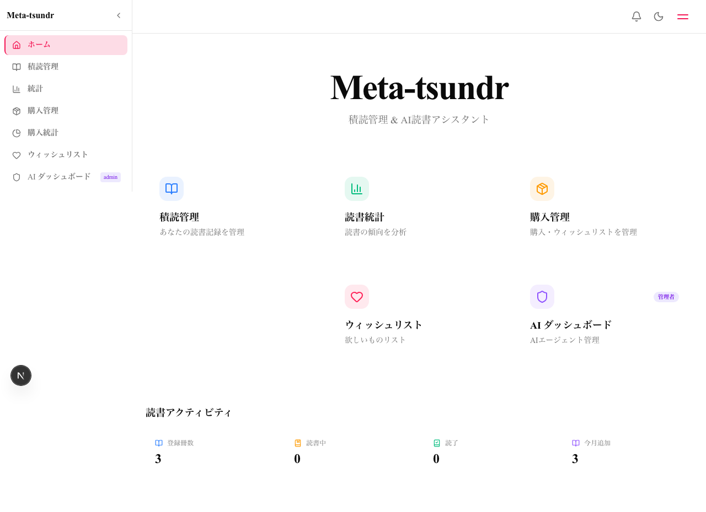
*ホーム - BentoGrid、text-display、glassカード*

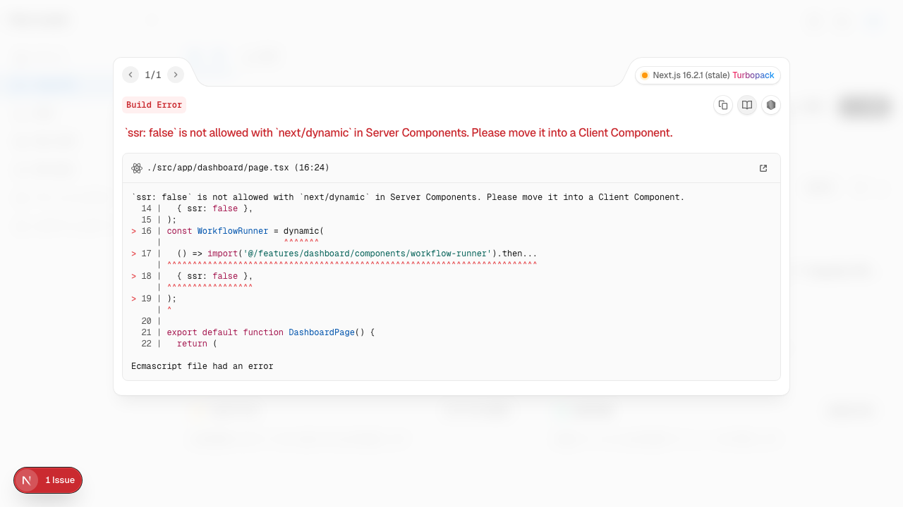
*積読管理 - 青テーマ、PageHeader (border-l-4)*


*書籍追加フォーム - クリアボタン付き*

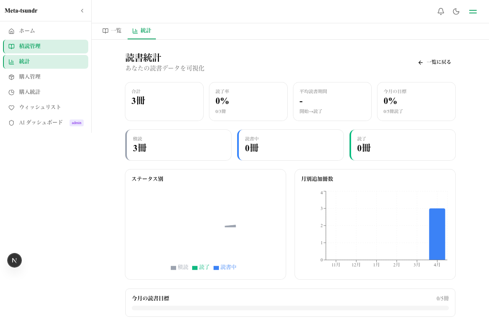
*読書統計 - エメラルドテーマ、PieChart/BarChart*

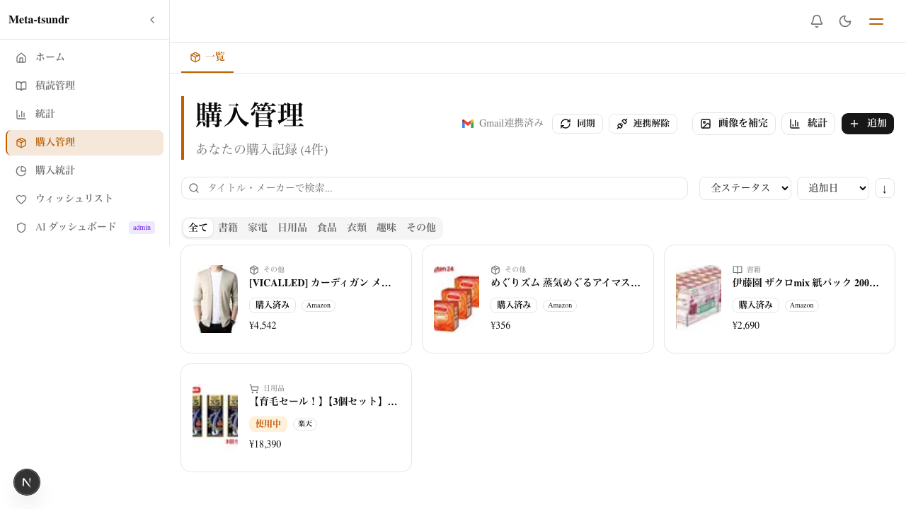
*購入管理 - アンバーテーマ、Gmail連携ボタン表示*

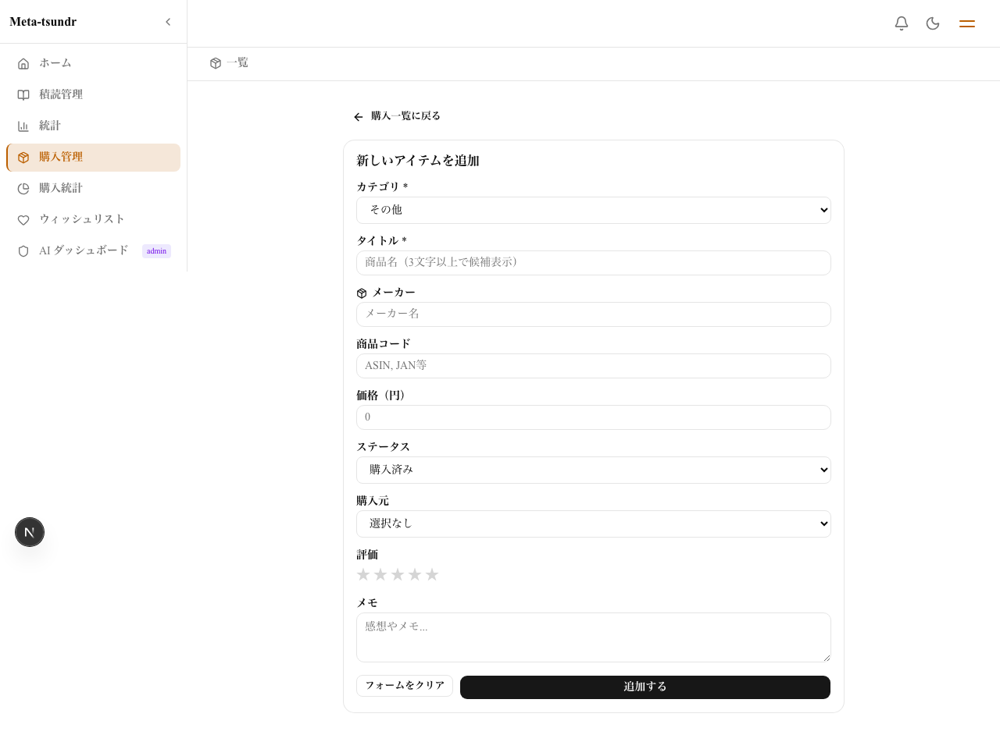
*商品追加フォーム - ソース切り替え (おすすめ/Amazon/楽天)*

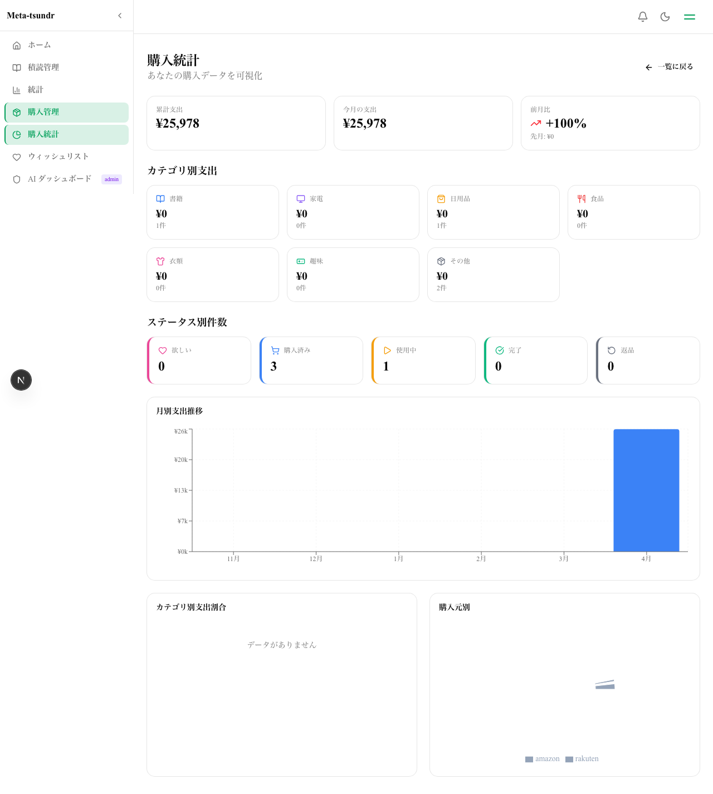
*購入統計ダッシュボード - カテゴリ別/月別/ソース別*

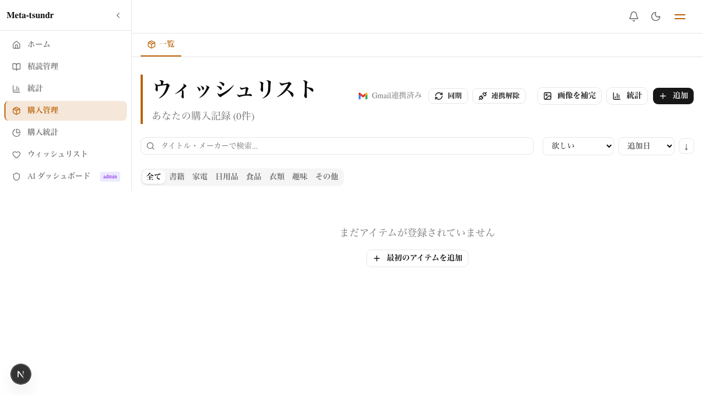
*ウィッシュリスト (/purchases?status=WISHLIST)*

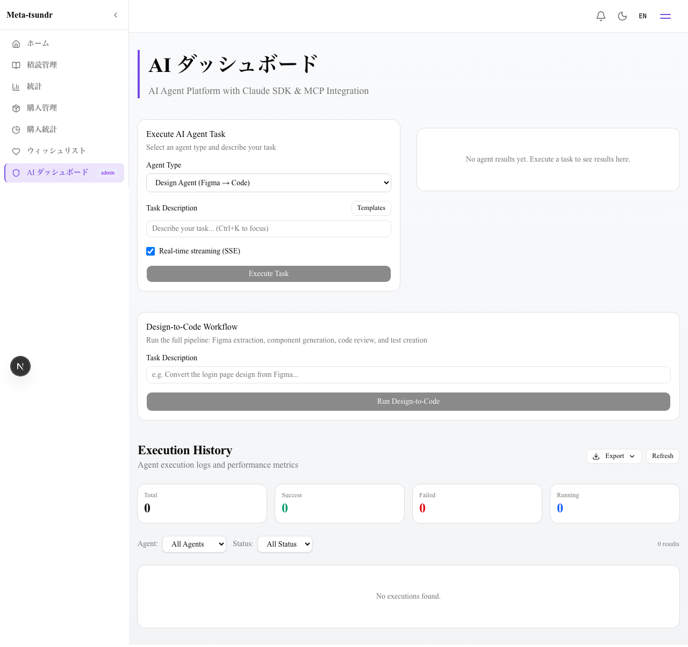
*AIダッシュボード - バイオレットテーマ*

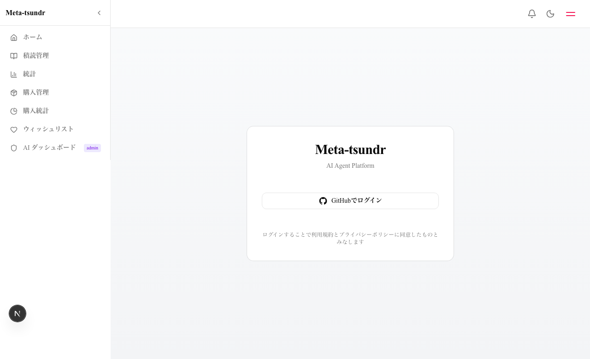
*ログインページ*

### ダークモード

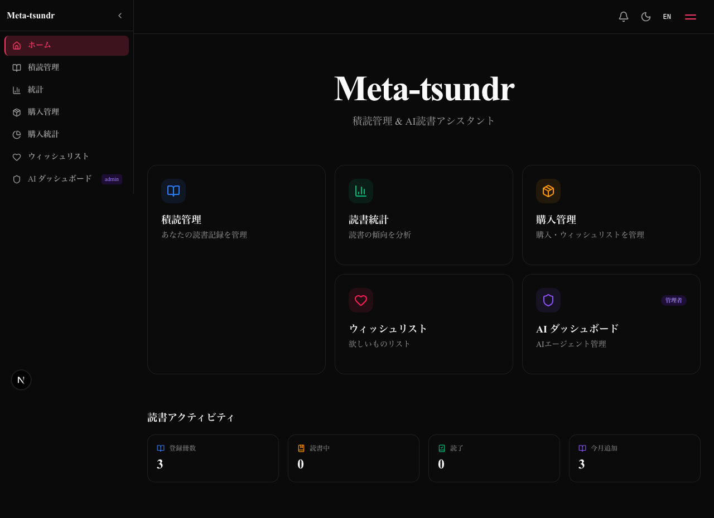
*ホーム - ダークモード*

### API

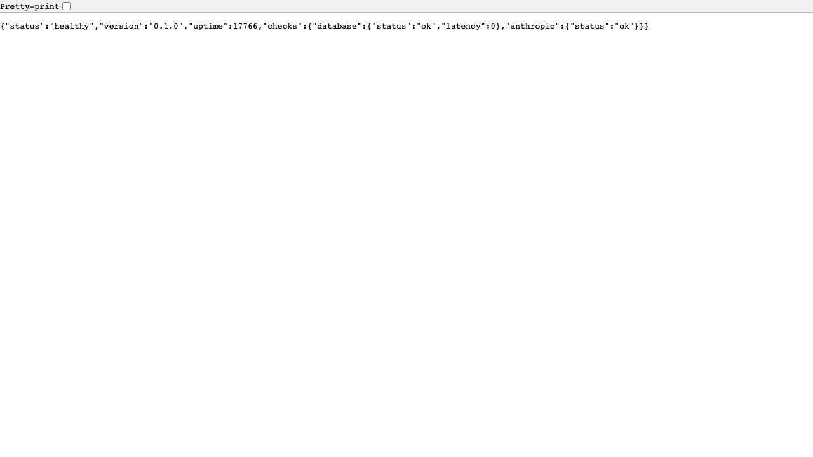
*ヘルスチェックAPI (/api/health)*

### モバイル

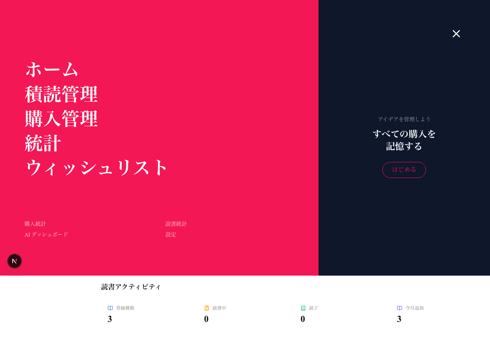
*フルスクリーンモバイルメニュー (page-accent背景, fade-in-up)*

---

## テスト結果

| テスト種別 | 結果 | 詳細 |
|---|---|---|
| E2Eスクリーンショット | PASS | 13枚全撮影完了 (8.1s) |
| Playwright テスト | 13 passed | 0 failed |

---

## 最近の変更点

- **画像エンリッチメント機能**: 購入商品の画像を外部APIから自動取得・補完する機能を追加
- **購入詳細ページ再デザイン**: 購入管理の詳細表示UIを刷新
- **ハンドラー分離リファクタリング**: Cal.com pattern に基づきルーターからハンドラーを分離、コードの可読性と保守性を向上
- **Prismaフォールバック**: Go バックエンド停止時にPrismaで自動フォールバックする仕組みを追加
- **認証なしCRUD**: 開発時に認証なしでBook/Item CRUDを使用可能に

---

## ファイル構成

```
evidence/
├── EVIDENCE-REPORT.md          # This file
├── screenshots/
│   ├── 01-home.png             # ホーム (BentoGrid)
│   ├── 02-books-list.png       # 積読管理一覧
│   ├── 03-books-new.png        # 書籍追加フォーム
│   ├── 04-books-stats.png      # 読書統計
│   ├── 05-purchases-list.png   # 購入管理一覧 (Gmail連携ボタン)
│   ├── 06-purchases-new.png    # 商品追加フォーム
│   ├── 07-purchases-stats.png  # 購入統計
│   ├── 08-wishlist.png         # ウィッシュリスト
│   ├── 09-dashboard.png        # AIダッシュボード
│   ├── 10-login.png            # ログインページ
│   ├── 11-dark-home.png        # ホーム (ダークモード)
│   ├── 12-health-api.png       # ヘルスチェックAPI
│   └── 13-fullscreen-menu.png  # フルスクリーンメニュー (モバイル)
├── logs/
├── test-reports/
└── night-run/
```
