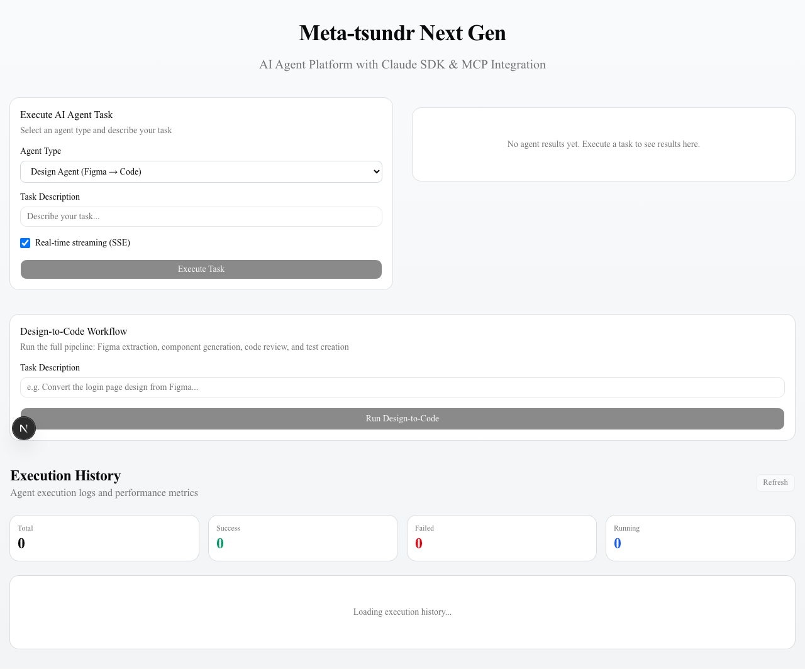

# Evidence Report - Meta Tsundr Next Gen

**Date**: 2026-03-30
**Project**: https://github.com/fffyyyfff/meta-tsundr-next-gen

---

## 1. TypeScript Compilation

**Result**: PASS (0 errors)

```
$ npx tsc --noEmit
(no output = success)
```

See: [logs/typecheck.log](./logs/typecheck.log)

---

## 2. E2E Test Results

**Result**: 21/21 PASSED

| Test File | Tests | Status |
|-----------|-------|--------|
| home.spec.ts | 2 | PASS |
| agent.spec.ts | 2 | PASS |
| dashboard.spec.ts | 4 | PASS |
| workflow.spec.ts | 4 | PASS |
| health.spec.ts | 2 | PASS |
| agent-api.spec.ts | 3 | PASS |
| evidence-capture.spec.ts | 4 | PASS |

Full HTML report: [test-reports/index.html](./test-reports/index.html)

---

## 3. Screenshots

### 3.1 Home / Dashboard


- Agent Type selector (Design, Code Review, Test Gen, Task Mgmt)
- Task Description input
- SSE streaming toggle
- Design-to-Code Workflow runner
- Execution History with status badges (Total, Success, Failed, Running)

### 3.2 Login Page


- GitHub OAuth2 login button
- Japanese localized UI

### 3.3 Health API


- `/api/health` returns JSON with status, version, uptime, checks
- database: ok, qdrant: unreachable (not running locally), anthropic: unconfigured

### 3.4 Agent Executor Form


- Agent type dropdown
- Task description input
- Real-time streaming (SSE) checkbox
- Execute Task button

---

## 4. Project Statistics

| Metric | Value |
|--------|-------|
| Source files (src/) | 65 |
| Total lines (src/) | 14,606 |
| Git commits | 10 |
| E2E tests | 21 (all passing) |
| TypeScript errors | 0 |
| Docker services | 3 (postgres, qdrant, web) |
| K8s manifests | 5 |
| Helm chart | 1 |
| AI agents | 4 + orchestrator |
| tRPC routers | 4 (agent, figma, linear, history) |

See: [logs/project-stats.log](./logs/project-stats.log)

---

## 5. Architecture Verification

### Implemented Phases (per ADR-001)

| Phase | Description | Status |
|-------|-------------|--------|
| Phase 1 | Infrastructure (Next.js 15, tRPC, Prisma, MCP, Qdrant) | COMPLETE |
| Phase 2 | AI Agents (Design, CodeReview, TestGen, TaskMgmt, Orchestrator) | COMPLETE |
| Phase 3 | Scalability (K8s, Auth, Rate Limiting, CI/CD, Docker) | COMPLETE |

### Additional Features

| Feature | Status |
|---------|--------|
| Dashboard UI | COMPLETE |
| DB Persistence (AgentExecution) | COMPLETE |
| OAuth2 Login (GitHub) | COMPLETE |
| SSE Realtime Streaming | COMPLETE |
| Data Visualization (stats, token usage) | COMPLETE |
| Error Boundary + Toast | COMPLETE |
| E2E Test Suite (21 tests) | COMPLETE |
| README Documentation | COMPLETE |
| Makefile | COMPLETE |
| tmux Multi-Agent Scripts | COMPLETE |

---

## 6. File Structure

```
evidence/
├── EVIDENCE-REPORT.md          # This file
├── screenshots/
│   ├── 01-home-dashboard.png   # Dashboard page
│   ├── 02-login-page.png       # OAuth login page
│   ├── 03-health-api.png       # Health API response
│   └── 04-agent-executor.png   # Agent executor form
├── logs/
│   ├── typecheck.log           # TypeScript compilation log
│   ├── project-stats.log       # Project statistics
│   └── evidence-capture.log    # Playwright evidence capture log
└── test-reports/
    └── index.html              # Playwright HTML report
```
