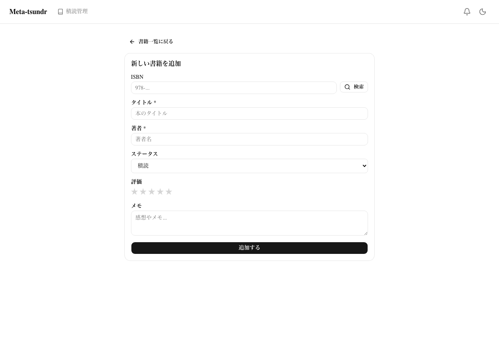

# Phase A Frontend Evidence — 2026-03-31

## タスク概要
積読管理（書籍管理）機能の Phase A フロントエンド実装

## 変更ファイル一覧

### 新規作成（12ファイル）
| ファイル | 説明 |
|----------|------|
| `src/server/routers/book.ts` | tRPC書籍ルーター: list(検索/フィルター/ソート/ページネーション), getById, create, update, delete(ソフトデリート) |
| `src/stores/bookStore.ts` | Zustand UIストア: activeFilter, searchQuery, viewMode, sortBy, sortOrder |
| `src/components/book-status-badge.tsx` | ステータスバッジ: 積読(gray)/読書中(blue)/読了(green) |
| `src/components/book-cover.tsx` | 書影: next/image or タイトル頭文字+グラデーション背景フォールバック |
| `src/components/book-card.tsx` | 書籍カード: BookCover(96x128), タイトル, 著者, StatusBadge, 星評価, DropdownMenu(編集/削除/ステータス変更) |
| `src/components/book-form.tsx` | React Hook Form + zod: ISBN(+ルックアップ), タイトル, 著者, ステータス, 評価(星クリック), メモ。create/edit両対応 |
| `src/app/books/layout.tsx` | AuthGuardレイアウト (dev mode自動認証) |
| `src/app/books/page.tsx` | 書籍一覧: Tabs(全て/積読/読書中/読了), 検索, ソート, 3列グリッド, 空状態表示 |
| `src/app/books/new/page.tsx` | 書籍追加: BookForm + book.create mutation → /booksリダイレクト |
| `src/app/books/[id]/page.tsx` | 書籍詳細: BookCover大, 全フィールド, ステータス変更ボタン, 編集/削除 |
| `src/app/books/[id]/edit/page.tsx` | 書籍編集: BookForm(defaultValues) + book.update mutation |

### 更新（2ファイル）
| ファイル | 変更内容 |
|----------|----------|
| `src/server/routers/_app.ts` | bookRouter追加 |
| `src/app/layout.tsx` | ヘッダーに「積読管理」ナビリンク(Bookアイコン付き)追加 |

## 検証結果

| 検証項目 | 結果 | ログ |
|----------|------|------|
| 型チェック (`tsc --noEmit`) | **PASS** — エラー0 | `typecheck.log` |
| ビルド (`next build`) | **PASS** — 全ページ生成 | `build.log` |

## スクリーンショット

### 1. 書籍一覧（空状態）

- 「積読管理」タイトル + 冊数表示
- 検索バー（タイトル・著者で検索）
- ソートセレクト（追加日/タイトル/著者/評価）+ 昇降順トグル
- タブフィルター: 全て / 積読 / 読書中 / 読了
- 「+ 追加」ボタン
- Skeleton loading 3列グリッド

### 2. 書籍追加フォーム

- ISBN入力 + Google Books API検索ボタン
- タイトル（必須）、著者（必須）
- ステータスセレクト（積読/読書中/読了）
- 星評価（クリックで選択/解除）
- メモ（テキストエリア）
- 「追加する」送信ボタン
- 全て日本語UI

### 3. ヘッダーナビゲーション

- Meta-tsundr ロゴ横に「積読管理」リンク（Bookアイコン付き）
