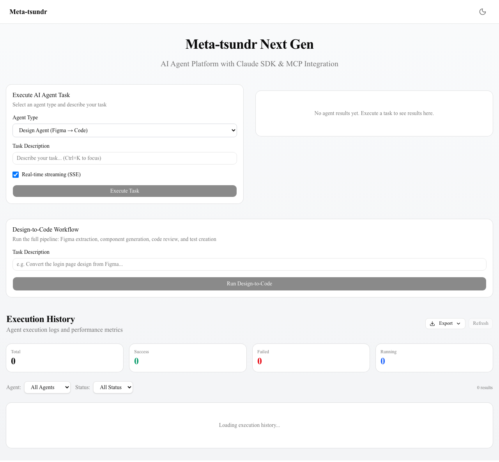

# Evidence: エクスポート機能実装

## セッション概要

| 項目 | 値 |
|------|-----|
| 日時 | 2026-03-31 |
| 構成 | Worker (pane %1) |
| タスク数 | 1 |

## 完了タスク一覧

| # | Pane | タスク | 主な対象ファイル |
|---|------|--------|------------------|
| 1 | %1 | エージェント実行エクスポート機能 | export.ts, export-button.tsx, dashboard.tsx, _app.ts |

## 変更ファイル一覧

| ファイル | 状態 |
|----------|------|
| `src/server/routers/export.ts` | 新規 |
| `src/components/export-button.tsx` | 新規 |
| `src/server/routers/_app.ts` | 更新 |
| `src/components/dashboard.tsx` | 更新 |

## 検証結果

| 検証項目 | 結果 | ログファイル |
|----------|------|-------------|
| TypeCheck (`tsc --noEmit`) | PASS | [typecheck.log](./typecheck.log) |
| Build (`next build`) | PASS | [build.log](./build.log) |

## スクリーンショット

ダッシュボード画面にExportボタンが配置されている状態。Refreshボタンの左にドロップダウン形式で表示。

## プロジェクト統計

| 項目 | 値 |
|------|-----|
| 新規ファイル数 | 2 |
| 更新ファイル数 | 2 |
| tRPCエンドポイント追加 | 3 (exportAsJson, exportAsMarkdown, exportAsCsv) |
