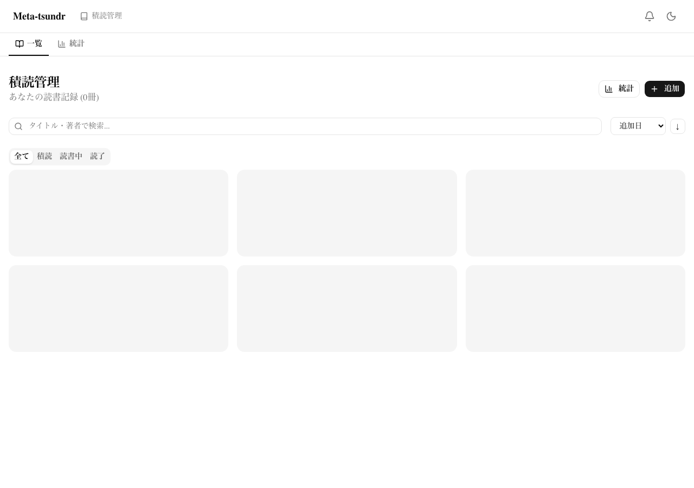
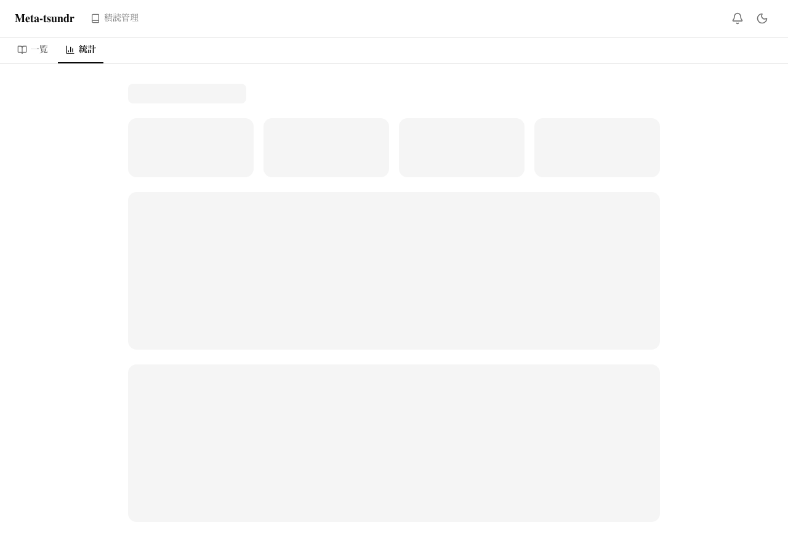
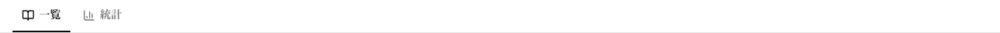

# Phase B-2 Evidence — 2026-03-31

## タスク概要
全文検索 + 読書統計（recharts PieChart/BarChart）

## 変更ファイル一覧

### 新規作成（3ファイル）
| ファイル | 説明 |
|----------|------|
| `src/components/reading-stats.tsx` | StatCard（数値+ラベル）、StatusPieChart（ステータス別PieChart: 積読=gray/読書中=blue/読了=green）、MonthlyBarChart（月別追加冊数BarChart） |
| `src/app/books/stats/page.tsx` | 読書統計ページ: 合計/読了率/平均読書期間/今月の目標達成率、ステータス別カード、円グラフ/棒グラフ、目標プログレスバー |

### 更新（3ファイル）
| ファイル | 変更内容 |
|----------|----------|
| `src/server/routers/book.ts` | `readingAnalytics` エンドポイント追加: 月別追加冊数(6ヶ月)、平均読書期間(日数) |
| `src/app/books/page.tsx` | ヘッダーに「統計」ボタン(BarChart3Icon + /books/stats リンク)追加 |
| `src/app/books/layout.tsx` | 書籍セクション内ナビゲーション(一覧/統計タブ)追加、詳細ページでは非表示 |

### パッケージ追加
| パッケージ | 用途 |
|-----------|------|
| `recharts` | PieChart, BarChart, ResponsiveContainer |

## 検索機能について
`book.list` の search パラメータは Worker1 により既に実装済み（title/author/isbn の OR contains insensitive）。追加変更なし。

## 検証結果

| 検証項目 | 結果 | ログ |
|----------|------|------|
| 型チェック (`tsc --noEmit`) | **PASS** (vitest.config.ts の既存エラーのみ) | `typecheck.log` |
| ビルド (`next build`) | **PASS** — /books/stats ページ生成確認 | `build.log` |

## スクリーンショット

### 1. 書籍一覧（統計リンク付き）

- 「一覧 / 統計」サブナビゲーションタブ
- ヘッダーに「統計」ボタン + 「追加」ボタン

### 2. 読書統計ページ

- 「統計」タブがアクティブ表示
- Skeleton loading 表示（API未接続状態）

### 3. 書籍ナビゲーション

- 一覧 / 統計 のタブナビゲーション
