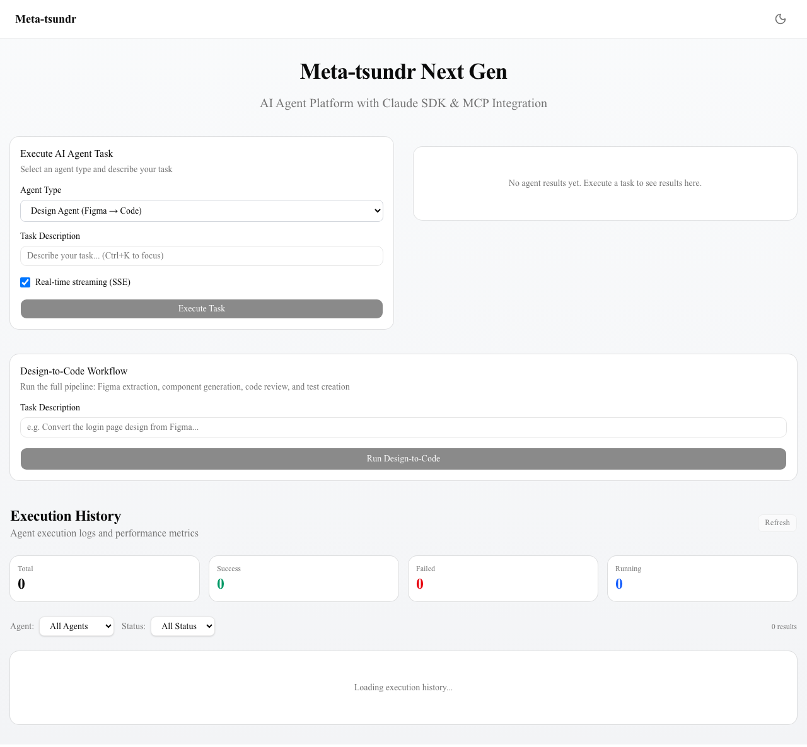
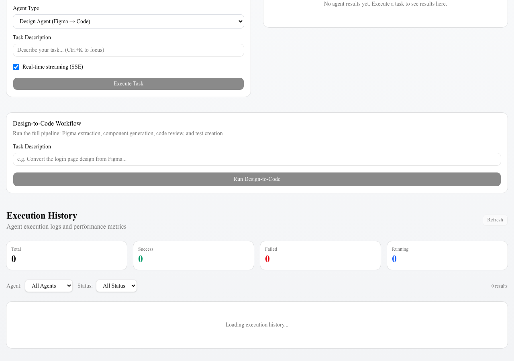
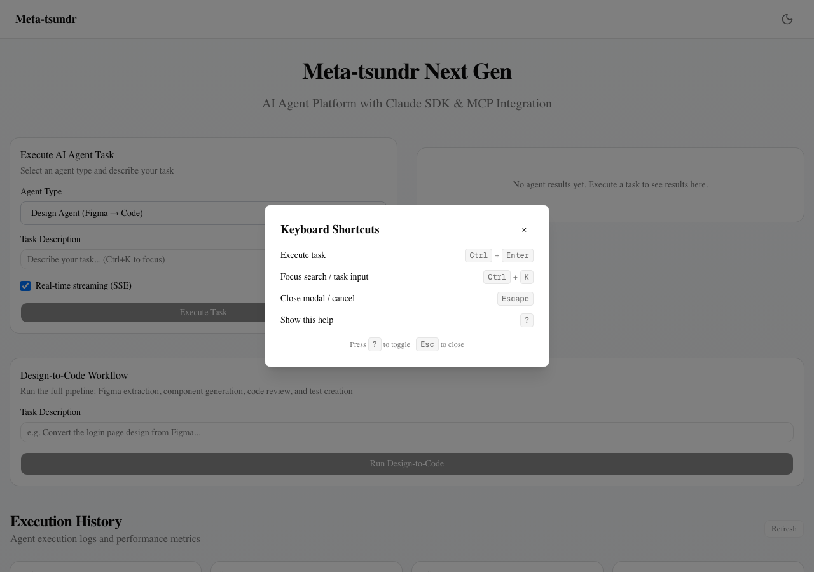
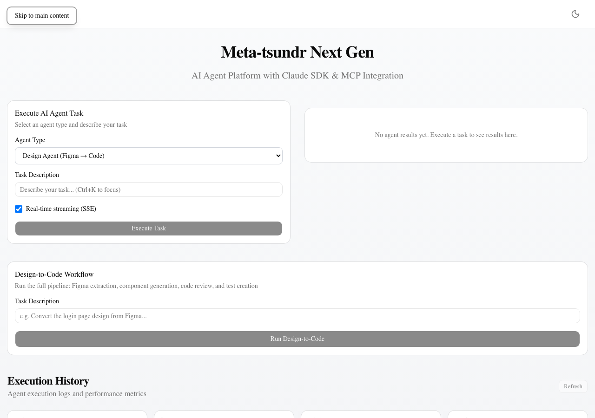

# Night Run Evidence Report — 2026-03-31 Session 2

## セッション概要
- **日時**: 2026-03-31
- **構成**: Orchestrator (%0) + Worker1 (%1) + Worker2 (%2)
- **タスク数**: 3（全件成功）

## 完了タスク一覧

| # | Pane | タスク | 主な対象ファイル |
|---|------|--------|------------------|
| 1 | %2 | ページネーション+フィルター | `src/hooks/usePagination.ts`, `src/server/routers/history.ts`, `src/components/dashboard.tsx` |
| 2 | %2 | ショートカット+a11y | `src/hooks/useKeyboardShortcut.ts`, `src/components/keyboard-shortcuts-help.tsx`, `src/components/skip-nav.tsx`, `src/components/agent-executor.tsx`, `src/app/layout.tsx` |
| 3 | %2 | 比較+お気に入り | `src/components/agent-comparison.tsx`, `src/components/favorites-list.tsx`, `src/stores/favoritesStore.ts`, `src/components/agent-results.tsx` |

## 変更ファイル一覧（全16ファイル）

### 新規作成（10ファイル）
| ファイル | 説明 |
|----------|------|
| `src/hooks/usePagination.ts` | 汎用ページネーションフック |
| `src/hooks/useKeyboardShortcut.ts` | キーボードショートカットフック |
| `src/components/keyboard-shortcuts-help.tsx` | ショートカット一覧モーダル（?キー） |
| `src/components/skip-nav.tsx` | スキップナビゲーション（a11y） |
| `src/components/agent-comparison.tsx` | エージェント実行結果の横並び比較 |
| `src/components/favorites-list.tsx` | お気に入り一覧（展開式） |
| `src/stores/favoritesStore.ts` | お気に入りZustandストア（localStorage永続化） |
| `src/components/usage-monitor.tsx` | 使用量モニタリング |
| `src/server/routers/usage.ts` | 使用量APIルーター |
| `src/server/services/usage-tracker.ts` | 使用量トラッカーサービス |

### 更新（6ファイル）
| ファイル | 変更内容 |
|----------|----------|
| `src/components/dashboard.tsx` | ページネーション（10件/ページ）、Agent/Statusフィルター追加 |
| `src/server/routers/history.ts` | page/limit/totalCountパラメータ追加 |
| `src/components/agent-executor.tsx` | Ctrl+Enter送信、Ctrl+Kフォーカス、aria-label追加 |
| `src/components/agent-results.tsx` | ★お気に入りボタン、⇔比較ボタン追加 |
| `src/app/layout.tsx` | SkipNav、KeyboardShortcutsHelp組み込み、`<main>`ランドマーク追加 |
| `src/server/routers/_app.ts` | usageルーター追加 |

## 検証結果

| 検証項目 | 結果 | ログ |
|----------|------|------|
| 型チェック (`tsc --noEmit`) | **PASS** — エラー0 | `typecheck.log` |
| ビルド (`next build`) | **PASS** — 全7ページ生成 | `build.log` |

## スクリーンショット

### 1. ダッシュボード全体（フィルター付き）

- Agent Typeフィルター（All Agents / Design / CodeReview / TestGen / TaskMgmt）
- Statusフィルター（All Status / Success / Failed / Running）
- Stats カード（Total / Success / Failed / Running）
- Task Description に `(Ctrl+K to focus)` ヒント表示

### 2. ダッシュボード下部（ページネーション）

- Execution History セクション
- Prev / Next ボタン、ページ番号表示
- 「0 results」件数表示

### 3. キーボードショートカットモーダル

- `?` キーで表示されるモーダル
- Ctrl+Enter: Execute task
- Ctrl+K: Focus search / task input
- Escape: Close modal / cancel
- ?: Show this help

### 4. スキップナビゲーション（a11y）

- Tab キーでフォーカス時に「Skip to main content」リンクが表示
- `#main-content` へのジャンプリンク

## プロジェクト統計

| Metric | Value |
|--------|-------|
| Source files (src/) | 80 |
| Total lines (src/) | 17,497 |
| TypeScript errors | 0 |
| Build status | PASS |
