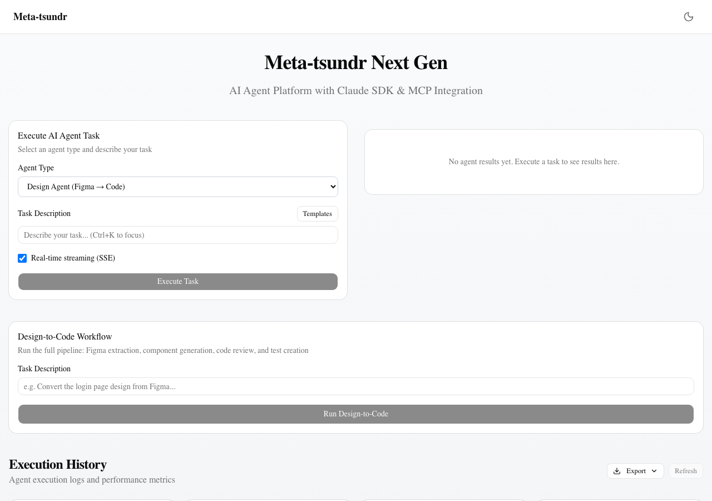
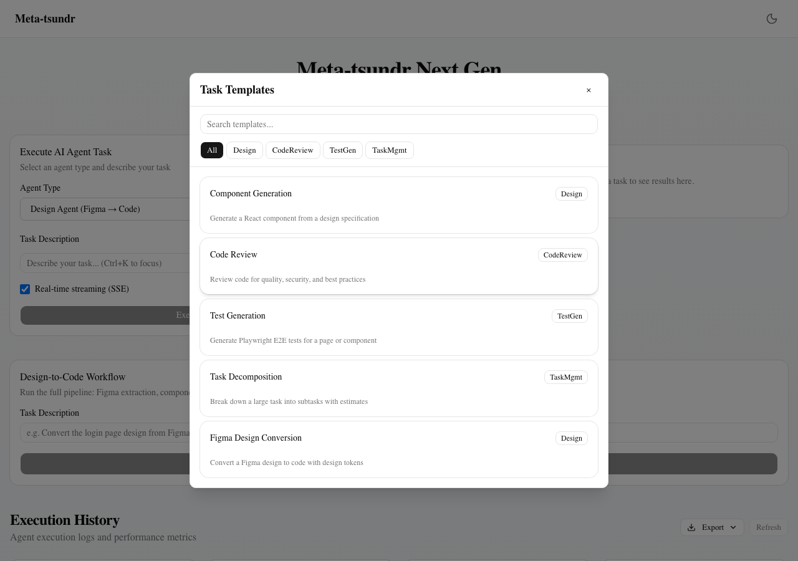
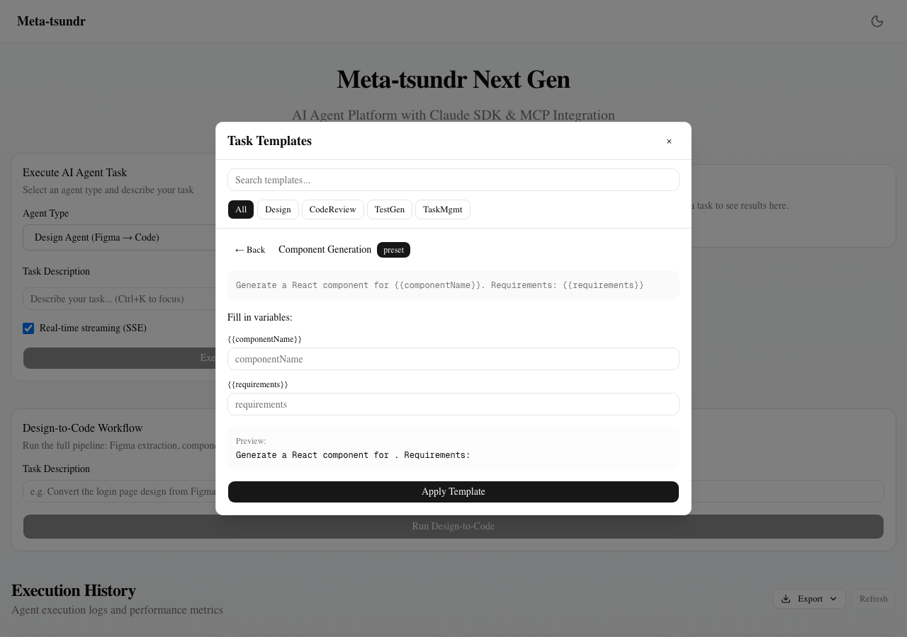

# Template Feature Evidence — 2026-03-31

## タスク概要
エージェントタスクテンプレート機能の実装（プリセット5個 + カスタムCRUD + 変数展開）

## 変更ファイル一覧

### 新規作成（3ファイル）
| ファイル | 説明 |
|----------|------|
| `src/stores/templateStore.ts` | Zustand + persist。プリセット5テンプレート、カスタムCRUD、localStorage永続化、`expandTemplate`/`extractVariables`ユーティリティ |
| `src/components/template-selector.tsx` | テンプレート選択モーダル。カテゴリタブ、検索フィルター、変数入力フォーム、リアルタイムプレビュー、ワンクリック反映 |
| `src/components/template-editor.tsx` | カスタムテンプレート作成・編集フォーム。名前、説明、agentType、promptテンプレート（`{{variable}}`検出・バッジ表示） |

### 更新（1ファイル）
| ファイル | 変更内容 |
|----------|----------|
| `src/components/agent-executor.tsx` | 「Templates」ボタン追加、TemplateSelector統合、選択時にtask+agentType自動反映 |

## プリセットテンプレート

| # | 名前 | Agent Type | 変数 |
|---|------|-----------|------|
| 1 | Component Generation | design | `{{componentName}}`, `{{requirements}}` |
| 2 | Code Review | code-review | `{{filePath}}`, `{{focusAreas}}` |
| 3 | Test Generation | test-gen | `{{targetPage}}`, `{{testScenarios}}` |
| 4 | Task Decomposition | task-mgmt | `{{taskDescription}}` |
| 5 | Figma Design Conversion | design | `{{figmaUrl}}`, `{{breakpoints}}` |

## 検証結果

| 検証項目 | 結果 | ログ |
|----------|------|------|
| 型チェック (`tsc --noEmit`) | **PASS** — エラー0 | `typecheck.log` |
| ビルド (`next build`) | **PASS** — 全7ページ生成 | `build.log` |

## スクリーンショット

### 1. Agent Executor with Templates Button

- Task Description ラベル横に「Templates」ボタン表示

### 2. Template Selector Modal

- 検索バー + カテゴリタブ（All/Design/CodeReview/TestGen/TaskMgmt）
- プリセット5テンプレート一覧、AgentTypeバッジ付き

### 3. Template Variable Form

- Component Generation テンプレート選択後
- `{{componentName}}`, `{{requirements}}` 入力フォーム
- リアルタイムプレビュー表示
- 「Apply Template」ボタンでタスク入力欄に反映
